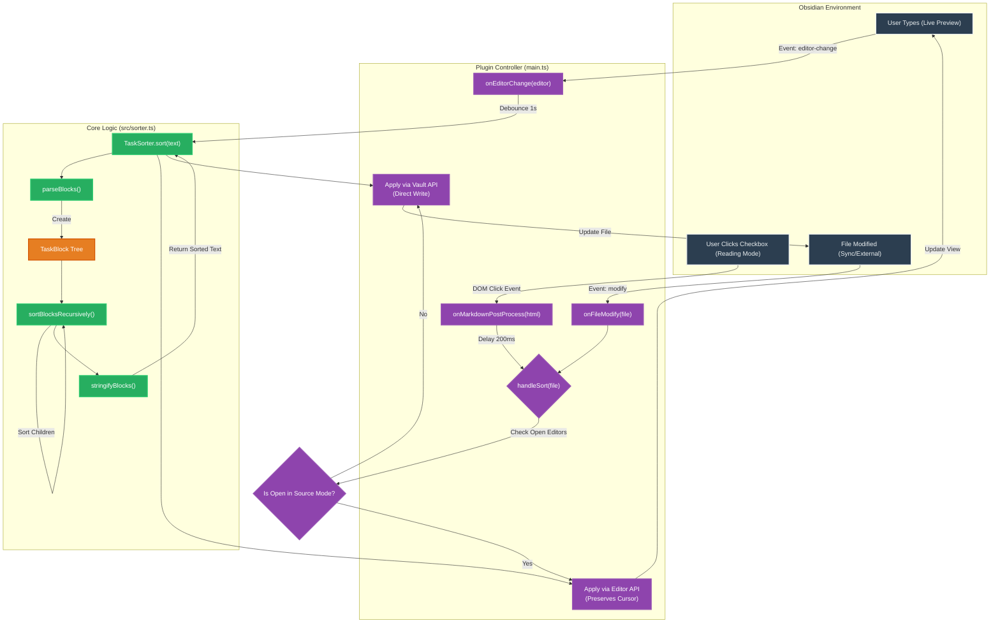

# DoneDrop Sorter

An Obsidian plugin that automatically moves completed tasks to the bottom of their lists.

## Features

- **Auto-sort**: Completed tasks (`- [x]`) are moved to the bottom of their indentation level.
- **Recursive**: Handles nested sub-tasks correctly.
- **Interactive**: Works in both Live Preview (Editor) and Reading Mode.

## Architecture Flow

The following diagram illustrates how the plugin handles events from different sources (Editor, Reading Mode, File System) and processes them using the core sorting logic.

## Development

1. Run `npm install` to install dependencies.
2. Run `npm run dev` to start compilation in watch mode.
3. Reload Obsidian to see changes.

## Build

Run `npm run build` to create `main.js`.

## Code Overview

- **`src/sorter.ts`**: **The Brain**. Contains the core logic for parsing Markdown text into a block tree, recursively sorting tasks (incomplete > complete), and rebuilding the string. Pure TypeScript, no Obsidian dependencies.
- **`main.ts`**: **The Glue**. Handles Obsidian API events (`editor-change` for typing, `vault.modify` for external/preview changes), debouncing, and applying the sorted text back to the editor.
- **`esbuild.config.mjs`**: **The Bundler**. Configures `esbuild` to bundle the TypeScript code into a single `main.js` file for Obsidian.
- **`manifest.json`**: Plugin metadata (id, version, name) required by Obsidian.
